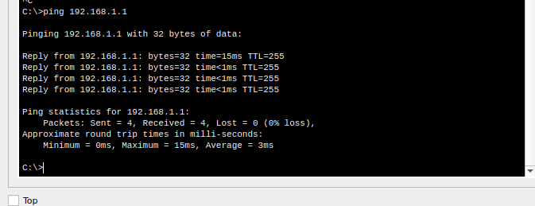

## Доступ к сетевым устройствам по протоколу SSH

Топология


1. 
- **R1**

```
enable
configure terminal
no ip domain-lookup
enable secret class
line con 0
password cisco
login
exit
line vty 0 4
password cisco
login
exit
service password-encryption 
banner login |Authorized Users Only|
interface gigabitEthernet 0/0/1
ip address 192.168.1.1 255.255.255.0
no shutdown
exit
exit
copy running-config startup-config
```

- **PC-A**

ping



2.
- **R1**

```
enable
configure termninal
hostname R1
ip domain-name study.local
crypto key generate rsa general-keys modulus 4096
username admin password Adm1nP@55
line vty 0 4
transport input ssh telnet
login local
exit
exit
copy running-config startup-config
```

- **PC-A**

подключение по ssh  к роутеру


3.

- **S1**

```
enable
configure terminal
no ip domain-lookup 
enable secret class
line con 0
password cisco
login
exit
line vty 0 4
password cisco
login
exit
service password-encryption 
banner motd |Authorized User Only|
interface vlan 1
ip address 192.168.1.11 255.255.255.0
no shutdown
exit
exit
copy running-config startup-config
```
- **S1**

```
enable
configure terminal
hostname S1
ip domain-name study.local
crypto key generate rsa general-keys modulus 4096
username admin password secret-p@ssw0rd
line vty 0 4
transport input ssh telnet
login local

```

- **PC-A**

подключение по ssh  к коммутатору


4. 

- **S1**

подключение по ssh к роутеру


