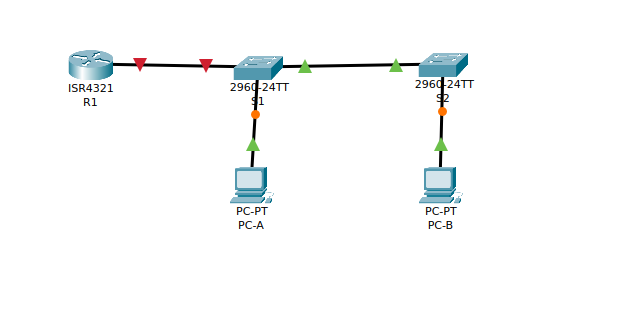
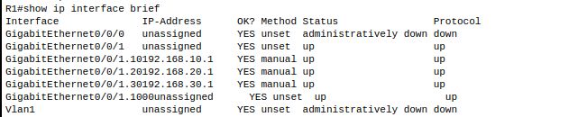
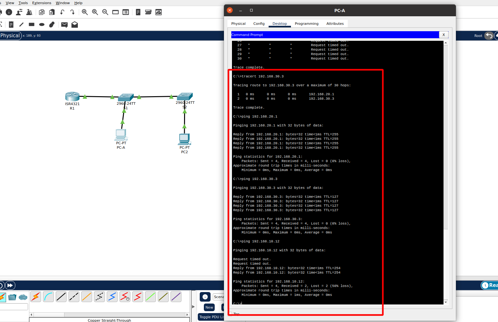
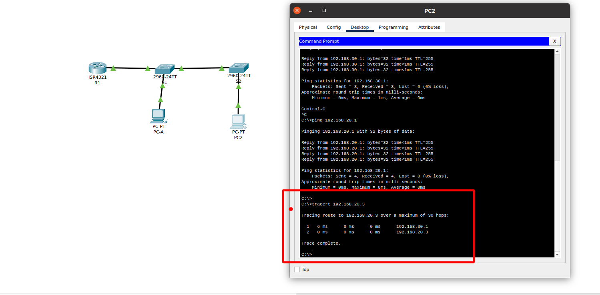

## Внедрение маршрутизации между виртуальными локальными сетями 

Топология



1.
- **R1**

```
enable
configure terminal
hostname R1
no ip domain-lookup
enable secret class
line con 0
password cisco
login
exit
line vty 0 4
password cisco
login
exit
service password-encryption 
banner login |Authorized Users Only|
exit
copy running-config startup-config
clock set 21:47:00 04 April 2022 
```
- **S1**
```
enable
configure terminal
hostname S1
no ip domain-lookup
enable secret class
line con 0
password cisco
login
exit
line vty 0 4
password cisco
login
exit
service password-encryption 
banner motd |Authorized Users Only|
exit
clock set 21:54:00 04 April 2022
copy running-config startup-config

```

- **S2**
```
enable
configure terminal
hostname S2
no ip domain-lookup
enable secret class
line con 0
password cisco
login
exit
line vty 0 4
password cisco
login
exit
service password-encryption 
banner motd |Authorized Users Only|
exit
clock set 21:54:00 04 April 2022
copy running-config startup-config

```
2.

 - **S1**

```
enable
configure terminal
vlan 10 
name MGMT
exit
interface vlan 10
ip address 192.168.10.11 255.255.255.0
no shutdown
exit
ip default-gateway 192.168.10.1
vlan 999
name parking_lot
exit
interface range f0/2-4, f0/7-24, g0/1-2
switchport mode access
switchport access vlan 999
shutdown
```
- **S2**

```
enable
configure terminal
vlan 10 
name MGMT
exit
interface vlan 10
ip address 192.168.10.12 255.255.255.0
no shutdown
exit
ip default-gateway 192.168.10.1
vlan 999
name parking_lot
exit
interface range interface range f0/2-17, f0/19-24, g0/1-2
switchport mode access
switchport access vlan 999
shutdown
```

- **S1**

```
enable
configure terminal
vlan 20
name sales
exit
interface f0/6
switchport mode access 
switchport access vlan 20
no shutdown
exit

```

- **S2**

```
enable
configure terminal
vlan 30
name operations
exit
interface f0/18
switchport mode access 
switchport access vlan 30
no shutdown
exit

```

3.

- **S1**

```
enable
configure terminal
vlan 1000
name Trunk
exit
interface f0/1
switchport mode trunk
switchport trunk native vlan 1000
switchport trunk allowed vlan 10,20,30,1000

```
- **S2**

```
enable
configure terminal
vlan 1000
name Trunk
exit
interface f0/1
switchport mode trunk
switchport trunk native vlan 1000
switchport trunk allowed vlan 10,20,30,1000

```

- **S1**

```
enable
configure terminal
interface f0/5
switchport mode trunk
switchport trunk native vlan 1000
switchport trunk allowed vlan 10,20,30,1000

```

4. 
- **R1**

```
enable
configure termianl
interface g0/0/1
no shutdown 
exit
interface g0/0/1.10
encapsulation dot1Q 10
ip address 192.168.10.1 255.255.255.0
exit
interface g0/0/1.20
encapsulation dot1Q 20
ip address 192.168.20.1 255.255.255.0
exit
interface g0/0/1.30
encapsulation dot1Q 30
ip address 192.168.30.1 255.255.255.0
exit
interface g0/0/1.1000
encapsulation dot1Q 1000 native

exit

```
**подинтефейсы**



**Проверка с PC-A**



**Проверка с PC-B**

