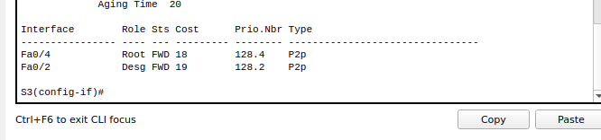

## Развертывание коммутируемой сети с резервными каналами

Топология


1.

- Базовая настройка коммутатора
**S1**

```

enable
configure terminal
hostname S1
no ip domain-lookup
enable secret class
line con 0
password cisco
login
exit
line vty 0 4
password cisco
login
exit
service password-encryption 
line con 0 
logging synchronous 
exit
banner motd |Authorized Users Only|
interface vlan 1
ip address 192.168.1.1 255.255.255.0
no shutdown
exit
exit
copy running-config startup-config
```

**S2**

```
enable
configure terminal
hostname S2
no ip domain-lookup
enable secret class
line con 0
password cisco
login
exit
line vty 0 4
password cisco
login
exit
service password-encryption 
line con 0 
logging synchronous 
exit
banner motd |Authorized Users Only|
interface vlan 1
ip address 192.168.1.2 255.255.255.0
no shutdown
exit
exit
copy running-config startup-config
```

**S3**

```
enable
configure terminal
hostname S3
no ip domain-lookup
enable secret class
line con 0
password cisco
login
exit
line vty 0 4
password cisco
login
exit
service password-encryption 
line con 0 
logging synchronous 
exit
banner motd |Authorized Users Only|
interface vlan 1
ip address 192.168.1.3 255.255.255.0
no shutdown
exit
exit
copy running-config startup-config
```

- Проверка связи


2. 
- Отключите все порты на коммутаторах.
**S1**, **S2**, **S3**

```
enable
configure terminal
interface range f0/1-24,g0/1-2
shutdown
exit
interface range f0/1-4
switchport mode trunk 
exit
interface range f0/2,f0/4
no shutdown 
exit
```
- Отобразите данные протокола spanning-tree.


- Роль и состояние активных портов


3.
- Наблюдение за процессом выбора протоколом STP порта, исходя из стоимости портов

**S2**

```
enable
configure terminanl
interface f0/4
spanning-tree vlan 1 cost 18
end
```


4. 
- Наблюдение за процессом выбора протоколом STP порта, исходя из приоритета портов

**S1**, **S2**, **S3**

```
enable
configure terminal
interface range f0/1, f0/3
no shutdown 
exit

```

