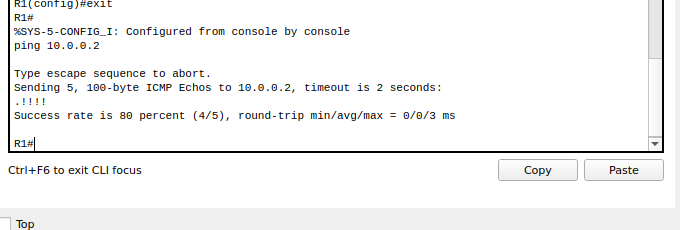
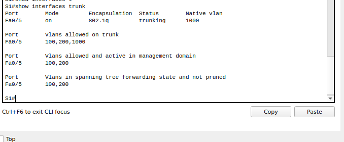
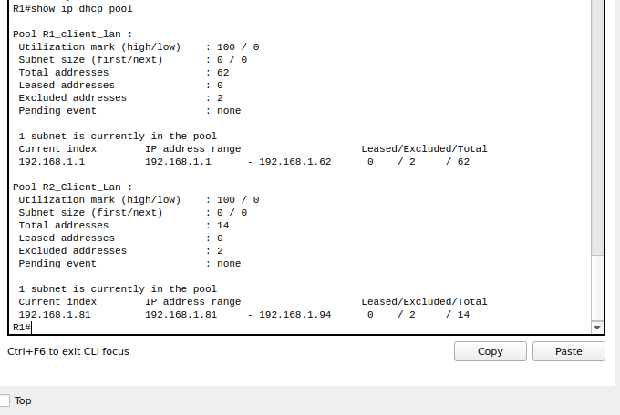
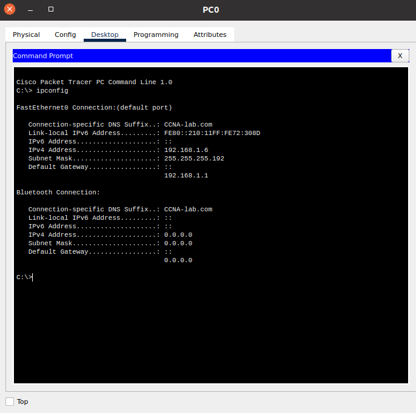
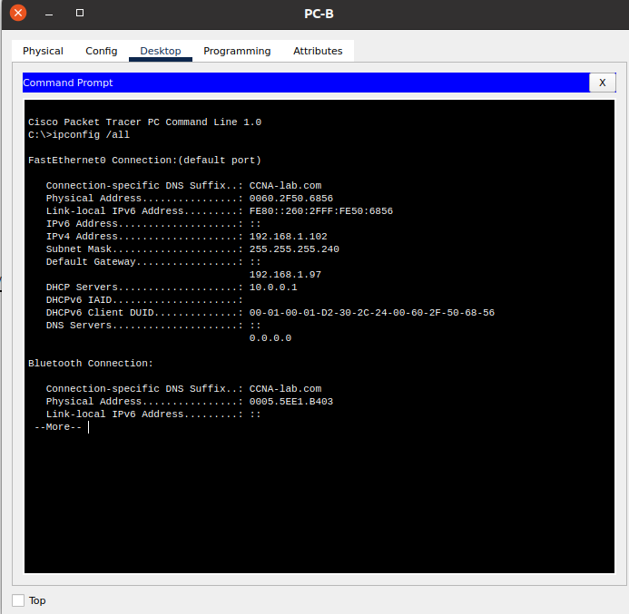
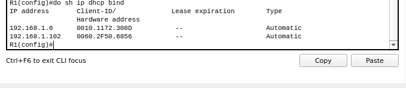

## Настройка DHCPv4 


- subnnet a
_____________________
|Device|Interface|Ip address|
|R1|G0/0/1.100| 192.168.1.1/26|
|R1|G0/0/1.200| 192.168.1.65/27|
|S1|vlan 200 | 192.168.1.66/27|
|R2|G0/0/1| 192.168.1.97/28|

- Базовая настройка

**R1**

```
enable
configure terminal
hostname R1
no ip domain-lookup
enable secret class
line con 0
password cisco
login
exit
line vty 0 4
password cisco
login
exit
service password-encryption 
banner login |Authorized Users Only|
exit
copy running-config startup-config 
clock set 20:57:00 02 May 2022

```

**R2**

```
enable
configure terminal
hostname R2
no ip domain-lookup
enable secret class
line con 0
password cisco
login
exit
line vty 0 4
password cisco
login
exit
service password-encryption 
banner login |Authorized Users Only|
exit
copy running-config startup-config 
clock set 20:59:00 02 May 2022

```

- Настройка маршрутизации между сетями VLAN на маршрутизаторе 
**R1**

```
enable
configure terminal
interface gigabitEthernet 0/0/1
no shutdown
exit
interface g0/0/1.100
encapsulation dot1Q 100
ip address 192.168.1.1 255.255.255.192 
description CLNT
exit
interface g0/0/1.200
encapsulation dot1Q 200
ip address 192.168.1.65 255.255.255.224
description MGMT
exit
interface g0/0/1.1000
encapsulation dot1Q 1000 native 
description NATIVE
exit
```

- Настройте G0/1 на R2, затем G0/0/0 и статическую маршрутизацию для обоих маршрутизаторов

**R2**

```
enable
configure t
interface g0/0/1
ip address 192.168.1.97 255.255.255.240
exit
interface g0/0/0
ip address 10.0.0.2 255.255.255.252
no shutdown 
exit
ip route 10.0.0.0 255.255.255.252 10.0.0.1
exit
copy running-config startup-config
```

**R1**

```
enable
configure t
interface g0/0/0
ip address 10.0.0.1 255.255.255.252
no shutdown 
exit
ip route 10.0.0.0 255.255.255.252 10.0.0.2

exit
copy running-config startup-config
```


- Настройте базовые параметры каждого коммутатора.

**S1**

```
enable
configure terminal
hostname S1
no ip domain-lookup
enable secret class
line con 0
password cisco
login
exit
line vty 0 4
password cisco
login
exit
service password-encryption 
banner motd |Authorized Users Only|
exit
copy running-config startup-config
clock set 21:28:00 02 May 2022
```

**S2**

```
enable
configure terminal
hostname S2
no ip domain-lookup
enable secret class
line con 0
password cisco
login
exit
line vty 0 4
password cisco
login
exit
service password-encryption 
banner motd |Authorized Users Only|
exit
copy running-config startup-config
clock set 21:30:00 02 May 2022

```

- Создайте сети VLAN (step 7,8)

**S1**

```
enable
configure terminal 
interface f0/6
switchport mode access 
switchport access vlan 100
exit
interface vlan 200
ip address 192.168.1.66 255.255.255.224
no shutdown
exit
ip default-gateway 192.168.1.65

interface range f0/1-4, f0/7-24, g0/1-2
switchport mode access 
switchport access vlan 999
shutdown 
exit
vlan 999
name Parking_lot
vlan 200
name MGMT
vlan 100
name CLNT
exit
```

**S2**

```
enable
configure terminal
interface vlan 1
ip address 192.168.1.98 255.255.255.240
no shutdown
exit
ip default-gateway 192.168.1.97
interface range f0/1-4, f0/6-17, f0/19-24, g0/1-2
shutdown 
```

- Вручную настройте интерфейс S1 F0/5 в качестве транка 802.1Q.

**S1**

```
enable
configure terminal
interface f0/5
switchport mode trunk
switchport trunk native vlan 1000
switchport trunk allowed vlan 100,200,1000
exit
exit
copy running-config startup-config 

```


## Настройка и проверка двух серверов DHCPv4 на R1

- Настройте R1 с пулами DHCPv4 для двух поддерживаемых подсетей.

**R1**

```
enable
configure terminal
ip dhcp excluded-address 192.168.1.1 192.168.1.5
ip dhcp excluded-address 192.168.1.97 192.168.1.101
ip dhcp pool R1_client_lan
network 192.168.1.0 255.255.255.192
domain-name CCNA-lab.com
default-router 192.168.1.1
lease 2 12 30
exit
ip dhcp pool R2_Client_Lan
network 192.168.1.96 255.255.255.240
domain-name CCNA-lab.com
default-router 192.168.1.97
lease 2 12 30
exit
ip route 192.168.1.96 255.255.255.240 10.0.0.2 
exit
copy running-config startup-config 
```

- lease 2 12 30 -- этой команды нет в Packet tracer, предположительно аренда задается вот так

- Проверка настроек





## Настройка и проверка DHCP-ретрансляции на R2

- Настройка R2 в качестве агента DHCP-ретрансляции для локальной сети на G0/0/1

**R2**

```
enable 
configure terminal
interface g0/0/1
ip helper-address 10.0.0.1
no shutdown 
end
copy running-config startup-config
```





