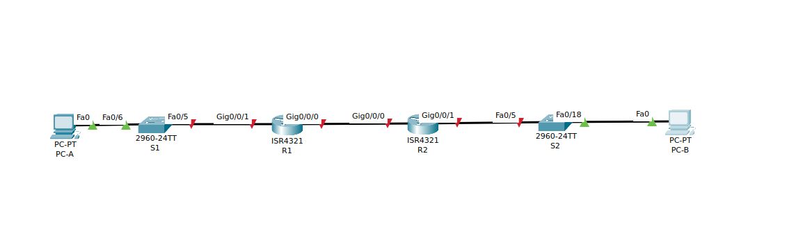
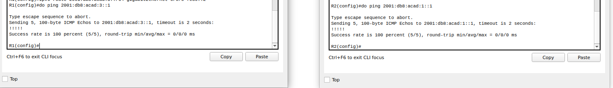
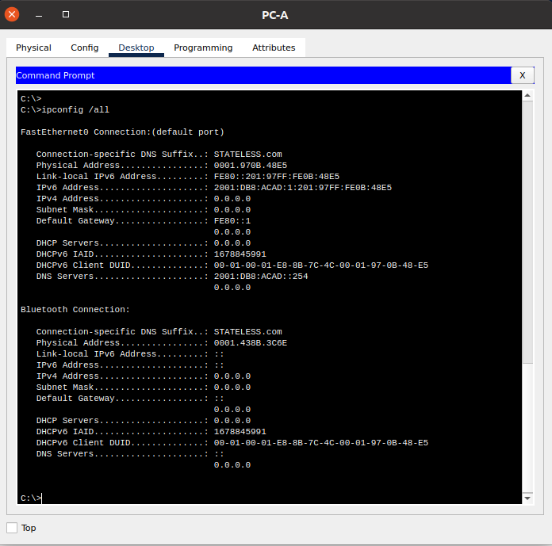

## Настройка DHCPv6 



- Базовая настройка коммутатора
**S1**

```
enable
configure terminal
hostname S1
no ip domain-lookup
enable secret class
line con 0
password cisco
login
exit
line vty 0 4
password cisco
login
exit
service password-encryption 
banner motd |Authorized Users Only|
interface range f0/1-4, f0/7-24, g0/1-2
shutdown
exit
copy running-config startup-config

```

**S2**

```

enable
configure terminal
hostname S2
no ip domain-lookup
enable secret class
line con 0
password cisco
login
exit
line vty 0 4
password cisco
login
exit
service password-encryption 
banner motd |Authorized Users Only|
interface range f0/1-4, f0/6-17, f0/19-24, g0/1-2
shutdown
exit
copy running-config startup-config

```

**R1**

```
enable
configure terminal
hostname R1
no ip domain-lookup
enable secret class
line con 0
password cisco
login
exit
line vty 0 4
password cisco
login
exit
service password-encryption 
banner login |Authorized Users Only|
ipv6 unicast-routing 
exit
copy running-config startup-config 

```

**R2**

```
enable
configure terminal
hostname R2
no ip domain-lookup
enable secret class
line con 0
password cisco
login
exit
line vty 0 4
password cisco
login
exit
service password-encryption 
banner login |Authorized Users Only|
ipv6 unicast-routing 
exit
copy running-config startup-config 

```

- Настройка интерфейсов и маршрутизации маршрутизаторов

**R1**

```
enable
configure terminal
interface g0/0/0
ipv6 address 2001:db8:acad:2::1/64
ipv6 address fe80::1 link-local 
no shutdown
exit
interface g0/0/1
ipv6 address 2001:db8:acad:1::1/64
ipv6 address fe80::1 link-local 
no shutdown
exit
ipv6 route 2001:db8:acad:3::/64 gigabitEthernet 0/0/0 fe80::2
exit
copy running-config startup-config 

```

**R2**

```
enable
configure terminal
interface g0/0/0
ipv6 address 2001:db8:acad:2::2/64
ipv6 address fe80::2 link-local 
no shutdown
exit
interface g0/0/1
ipv6 address 2001:db8:acad:3::1/64
ipv6 address fe80::1 link-local 
no shutdown
exit
ipv6 route 2001:db8:acad:1::/64 gigabitEthernet 0/0/0 fe80::1
exit
copy running-config startup-config 

```

Проверка



- Настройка и проверка сервера DHCPv6 на R1

**R1**

```
enable
configure terminal
ipv6 dhcp pool R1-STATELESS
dns-server 2001:db8:acad::254
domain-name STATELESS.com
exit
interface g0/0/1
ipv6 nd other-config-flag 
exit
exit
copy running-config startup-config 

```

Проверка



- Настройка сервера DHCPv6 с сохранением состояния на R1

**R1**

```
enable 
configure terminal
ipv6 dhcp pool R2-STATEFUL
address prefix 2001:db8:acad:3:aaa::/80
dns-server 2001:db8:acad::254
domain-name STATEFUL.com
exit
interface g0/0/0
ipv6 dhcp server R2-STATEFUL
end
copy running-config startup-config 
```

- Настройка и проверка ретрансляции DHCPv6 на R2

**R2**

```
enable
configure terminal 
interface g0/0/1
ipv6 nd managed-config-flag
```

в Packet Tracer команда ipv6 dhcp relay не доступна
```
ipv6 dhcp relay destination 2001:db8:acad:2::1 g0/0/0 
end
copy running-config startup-config 
```

**Тут должен быть скрин, но в Packet Tracer команда ipv6 dhcp relay недоступна**