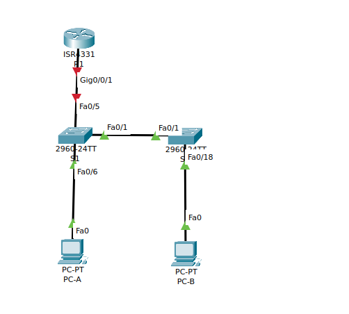
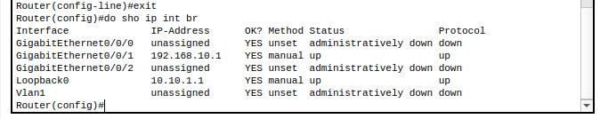
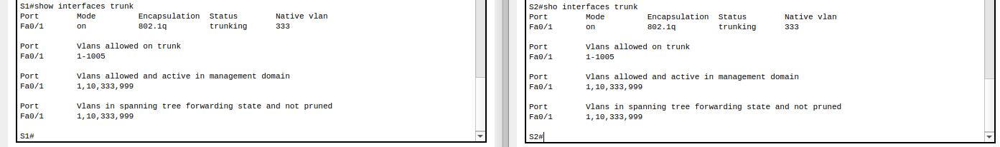
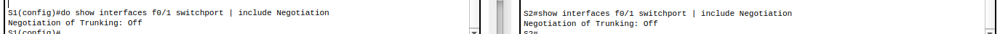
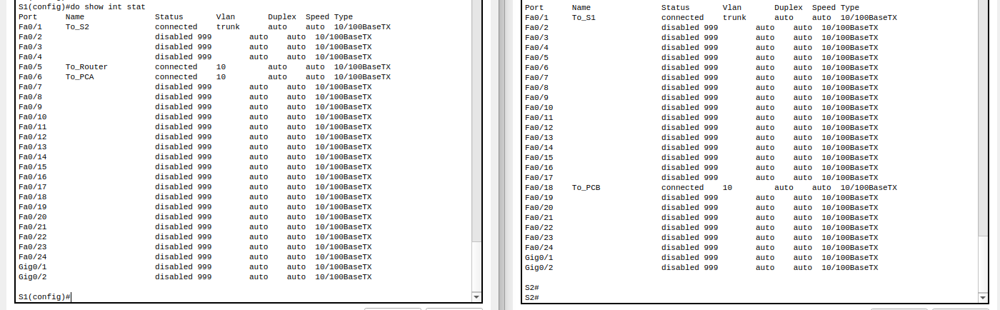
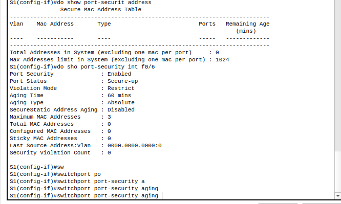
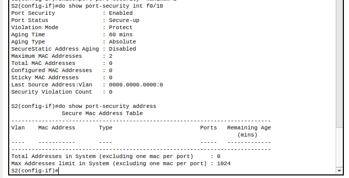
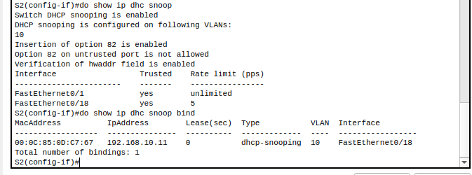
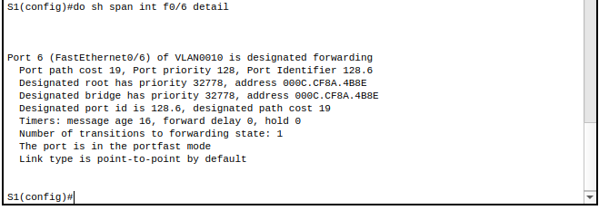
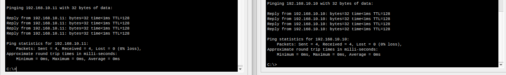

## Конфигурация безопасности коммутатора 



- Настройте маршрутизатор R1.

**R1**

```
enable
configure terminal
hostname R1
no ip domain lookup
ip dhcp excluded-address 192.168.10.1 192.168.10.9
ip dhcp excluded-address 192.168.10.201 192.168.10.202
!
ip dhcp pool Students
 network 192.168.10.0 255.255.255.0
 default-router 192.168.10.1
 domain-name CCNA2.Lab-11.6.1
!
interface Loopback0
 ip address 10.10.1.1 255.255.255.0
!
interface GigabitEthernet0/0/1
 description Link to S1
 ip dhcp relay information trusted
 ip address 192.168.10.1 255.255.255.0
 no shutdown
!
line con 0
 logging synchronous
 exec-timeout 0 0
```



- Настройка и проверка основных параметров коммутатора

**S1**

```
enable
configure terminal 
hostname S1
no ip  domain-lookup 
interface f0/5
description To_Router
interface f0/1
description To_S2
interface f0/6
desc To_PCA
exit
ip default-gateway 192.168.10.1

```


**S2**

```
enable
configure terminal 
hostname S2
no ip  domain-lookup 
interface f0/1
description To_S1
int f0/18
desc To_PCB
exit
```

- Настройка сетей VLAN на коммутаторах.


**S1**

```
enable
configure terminal 
vlan 10
name Management
interface vlan 10
ip address 192.168.10.201 255.255.255.0
description management_vlan
no shutdown 
exit
vlan 333
name Native
vlan 999
name ParkingLot
exit

```

**S2**

```
enable
configure terminal 
vlan 10
name Management
interface vlan 10
ip address 192.168.10.202 255.255.255.0
description management_vlan
no shutdown 
exit
vlan 333
name Native
vlan 999
name ParkingLot
exit
```


- Настройки безопасности коммутатора.

**S1**

```
enable
configure terminal 
interface f0/1
switchport mode trunk 
switchport trunk native vlan 333
switchport nonegotiate 
```

**S2**

```
enable
configure terminal 
interface f0/1
switchport mode trunk 
switchport trunk native vlan 333
switchport nonegotiate 
```





- Настройка портов доступа

**S1**

```
enable
configure terminal 
interface range f0/5-6
switchport mode access 
switchport access vlan 10

```

**S2**

```
enable
configure terminal 
interface f0/18
switchport mode access 
switchport access vlan 10
```

- Безопасность неиспользуемых портов коммутатора

**S1**

```
enable
configure terminal 
interface range f0/2-4, f0/7-24, g0/1-2
switchport mode access 
switchport access vlan 999
shutdown 
```

**S2**

```
enable
configure terminal 
interface range f0/2-17, f0/19-24, g0/1-2
switchport mode access 
switchport access vlan 999
shutdown 
```



- Документирование и реализация функций безопасности порта.

Функция | Настройка по умолчанию
---|---
Защита портов | Disabled
Максимальное количество записей MAC-адресов | 1
Режим проверки на нарушение безопасности | Shutdown
Aging Time | 0 mins 
Aging Type | Absolute 
Secure Static Address Aging | Disabled 
Sticky MAC Address | 0

**S1**

```
enable
configure terminal
int f0/6
switchport port-security
switchport port-security violation restrict 
switchport port-security aging time 60
switchport port-security aging type inactivity
switchport port-security maximum 3

```

 В Packet tracer нет команды switchport port-security aging type inactivity, предположительно так меняется тип устаревания

 

 **S2**

 ```
enable 
configure terminal 
switchport port-security 
switchport port-security  violation protect
switchport port-security  aging time 60
switchport port-security  maximum 2
 ```

 

 - Реализовать безопасность DHCP snooping.

 **S2**

 ```
enable 
configure terminal 
ip dhcp snooping 
ip dhcp snooping vlan 10 
interface f0/1
ip dhcp snooping trust 
int f0/18
ip dhcp snooping limit rate 5
 ```

  


- Реализация PortFast и BPDU Guard

**S1** 

```
enable 
configure terminal 
interface f0/6
spanning-tree portfast 
spanning-tree bpduguard enable 
```

**S2**

```
enable 
configure terminal 
interface f0/18
spanning-tree portfast 
spanning-tree bpduguard enable 

```

  

  - Проверьте наличие сквозного подключения.
    
    