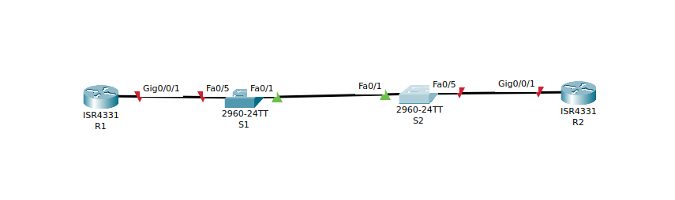
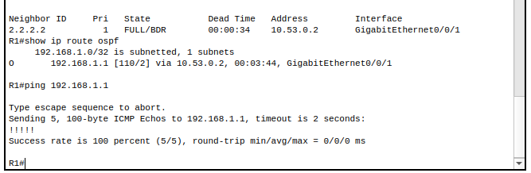
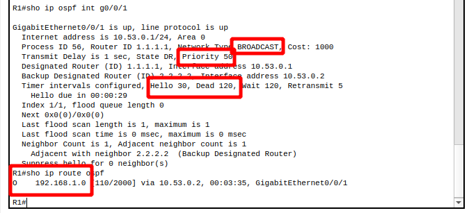
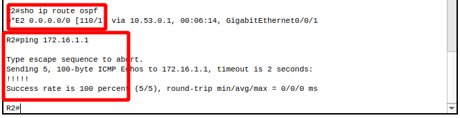

## Настройка протокола OSPFv2 для одной области



- Базовая настройка маршрутизаторов.

**R1**

```
enable
configure terminal
hostname R1
no ip domain-lookup
enable secret class
line con 0
password cisco
login
exit
line vty 0 4
password cisco
login
exit
service password-encryption 
banner login |Authorized Users Only|
exit
copy running-config startup-config 
```

**R2**

```
enable
configure terminal
hostname R2
no ip domain-lookup
enable secret class
line con 0
password cisco
login
exit
line vty 0 4
password cisco
login
exit
service password-encryption 
banner login |Authorized Users Only|
exit
copy running-config startup-config 
```

- базовые параметры каждого коммутатора

**S1**

```

enable
configure terminal
hostname S1
no ip domain-lookup
enable secret class
line con 0
password cisco
login
exit
line vty 0 4
password cisco
login
exit
service password-encryption 
banner motd |Authorized Users Only|
exit
copy running-config startup-config 

```

**S2**

```
enable
configure terminal
hostname S2
no ip domain-lookup
enable secret class
line con 0
password cisco
login
exit
line vty 0 4
password cisco
login
exit
service password-encryption 
banner motd |Authorized Users Only|
exit
copy running-config startup-config 

```

- Настройка адреса интерфейса и базового OSPFv2 на каждом маршрутизаторе.

**R1**

```
enable
configure terminal
interface loopback 1
ip address 172.16.1.1 255.255.255.0
interface g0/0/1
ip address 10.53.0.1 255.255.255.0
no shutdown
exit
router ospf 56
router-id 1.1.1.1
exit
interface gigabitEthernet 0/0/1
ip ospf 56 area 0
```

**R2**

```
enable
configure terminal
interface loopback 1
ip address 192.168.1.1 255.255.255.0
interface g0/0/1
ip address 10.53.0.2 255.255.255.0
no shutdown
exit
router ospf 56
router-id 2.2.2.2
exit
interface gigabitEthernet 0/0/1
ip ospf 56 area 0
interface loopback1
ip ospf 56 area 0
```



- Реализация различных оптимизаций на каждом маршрутизаторе

- Изменение приоритета, hello  интервала

**R1**

```
enable
configure terminal
int g0/0/1
ip ospf priority 50
ip ospf hello-interval 30
ip ospf dead-interval 120
```

**R2**

```
enable
configure terminal
int g0/0/1
ip ospf hello-interval 30
ip ospf dead-interval 120
```
- Распространение статического маршрута

**R1**

```
enable
configure terminal
ip route 0.0.0.0 0.0.0.0 loopback 1
router ospf 56
default-information originate 

```

- Точка-точка, пассивный интерфейс

**R2**

```
enable
configure terminal
ip ospf network point-to-point 
exit
router ospf 56
passive-interface loopback 1
```

- Изменение полосы пропускания

**R1**

```
enable
configure terminal
interface g0/0/1
ip ospf cost 1000
do clear ip ospf process
```

**R2**

```
enable
configure terminal
interface g0/0/1
ip ospf cost 1000
int l1
ip ospf cost 1000
do clear ip ospf process
```
- Проверка оптимизации




