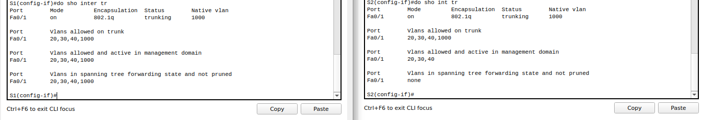

## Настройка и проверка расширенных списков контроля доступа


-  Базовая настройка маршрутизаторов

**R1**

```
enable
configure terminal
hostname R1
no ip domain-lookup
enable secret class
line con 0
password cisco
login
exit
line vty 0 4
password cisco
login
exit
service password-encryption 
banner login |Authorized Users Only|
exit
copy running-config startup-config 
```

**R2**

```
enable
configure terminal
hostname R2
no ip domain-lookup
enable secret class
line con 0
password cisco
login
exit
line vty 0 4
password cisco
login
exit
service password-encryption 
banner login |Authorized Users Only|
exit
copy running-config startup-config 
```
 - Базовая настройка коммутатора

**S1**

```

enable
configure terminal
hostname S1
no ip domain-lookup
enable secret class
line con 0
password cisco
login
exit
line vty 0 4
password cisco
login
exit
service password-encryption 
banner motd |Authorized Users Only|
exit
copy running-config startup-config 

```

**S2**

```

enable
configure terminal
hostname S2
no ip domain-lookup
enable secret class
line con 0
password cisco
login
exit
line vty 0 4
password cisco
login
exit
service password-encryption 
banner motd |Authorized Users Only|
exit
copy running-config startup-config 

```

- Vlan

**S1**

```
enable
configure terminal
interface fastEthernet 0/6
switchport mode access 
switchport access vlan 30
exit
vlan 30
name Operations
vlan 40
name Sales
vlan 20 
name Management
vlan 999
name ParkingLot
exit
interface vlan 20
ip address 10.20.0.2 255.255.255.0
exit
ip default-gateway 10.20.0.1
interface range F0/2-4, f0/7-24,g0/1-2
switchport mode access 
switchport access vlan 999
shutdown 
exit
```

**S2**

```
enable
configure terminal
vlan 20
name Management
vlan 30 
name Operations
vlan 40 
name Sales
vlan 999
name ParkingLot
exit
interface f0/5
switchport mode access 
switchport access vlan 20
interface f0/18
switchport mode access 
switchport access vlan 40
exit
interface vlan 20
ip address 10.20.0.3 255.255.255.0
exit
ip default-gateway 10.20.0.1
interface range f0/2-4, f0/6-17, f0/19-24, g0/1-2
switchport mode access
switchport access vlan 999
shutdown
exit
```


- Trunk 

- F0/1

**S1**

```
enable
configure terminal
interface f0/1
switchport mode trunk
switchport trunk native vlan 1000
switchport trunk allowed vlan 20,30,40,1000
exit
```

**S2**

```
enable
configure terminal
interface f0/1
switchport mode trunk
switchport trunk native vlan 1000
switchport trunk allowed vlan 20,30,40,1000
exit
```


- F0/5

**S1**

```
enable
configure terminal
interface f0/5
switchport mode trunk
switchport trunk native vlan 1000
switchport trunk allowed vlan 20,30,40,1000
do copy run st
```


- Настройка маршрутизации

- Настройка маршрутизации между сетями VLAN на R1.

**R1**

```
enable
conf t
interface gigabitEthernet 0/0/1
no shutdown 
exit
interface gigabitEthernet 0/0/1.20
encapsulation dot1Q 20
ip address 10.20.0.1 255.255.255.0
interface gigabitEthernet 0/0/1.30
encapsulation dot1Q 30 
ip address 10.30.0.1 255.255.255.0
interface gigabitEthernet 0/0/1.40
encapsulation dot1Q 40 
ip address 10.40.0.1 255.255.255.0
interface gigabitEthernet 0/0/1.1000
encapsulation dot1Q 1000 native 
interface loopback 0
ip address 172.16.1.1 255.255.255.0
exit
```


- Настройка интерфейса R2 g0/0/1

**R2**

```
en
conf t
interface g0/0/1
ip address 10.20.0.4 255.255.255.0
no shutdown
exit
ip route 0.0.0.0 0.0.0.0 10.20.0.1
exit
```

- Настройка всех сетевых устройств для базовой поддержки SSH.

**R1**

```
enable
configure terminal
username SSHadmin password $cisco123!
ip domain-name ccna-lab.com
crypto key generate rsa general-keys modulus 1024
ip ssh version 2
line vty 0 4
transport input ssh
login local
exit
```

**R2**

```
enable
configure terminal
username SSHadmin password $cisco123!
ip domain-name ccna-lab.com
crypto key generate rsa general-keys modulus 1024
ip ssh version 2
line vty 0 4
transport input ssh
login local
exit
```


**S1**

```
enable
configure terminal
username SSHadmin password $cisco123!
ip domain-name ccna-lab.com
crypto key generate rsa general-keys modulus 1024
ip ssh version 2
line vty 0 4
transport input ssh
login local
exit
```

**S2**

```
enable
configure terminal
username SSHadmin password $cisco123!
ip domain-name ccna-lab.com
crypto key generate rsa general-keys modulus 1024
ip ssh version 2
line vty 0 4
transport input ssh
login local
exit
```

- Включение защищенной веб-службы с проверкой подлинности на R1.

**R1**

```
enable
configure terminal
ip http secure-server 
ip http authentication local
```
В PacketTracer  данных команд нет

- Проверка подключения


- ### ACL

**R1**

**Operations**
```
enable
configure terminal
ip access-list extended OPS_OUT
deny icmp any 10.40.0.0 0.0.0.255
permit icmp any any
exit
int g0/0/1.30
ip access-group OPS_OUT in
exit

```


**Sales**

```
enable
configure terminal
ip access-list extended SALES_BLOCK
deny tcp 10.40.0.0 0.0.0.255 10.20.0.0 0.0.0.255 eq 22
permit tcp any any eq 22
deny tcp 10.40.0.0 0.0.0.255 10.20.0.0 0.0.0.255 eq 80
deny 10.40.0.0 0.0.0.255 10.20.0.0 0.0.0.255
deny tcp 10.40.0.0 0.0.0.255  10.30.0.0 0.0.0.255 eq 80
deny tcp 10.40.0.0 0.0.0.255  10.30.0.0 0.0.0.255 eq 443
deny icmp any 10.20.0.0 0.0.0.255
deny icmp any 10.30.0.0 0.0.0.255
permit icmp any any
permit tcp any any
exit
int g0/0/1.40
ip access-group SALES_BLOCK in
exit
```

- Проверка


