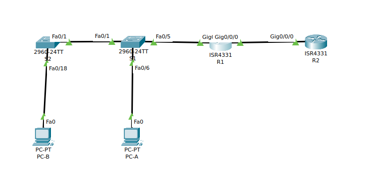
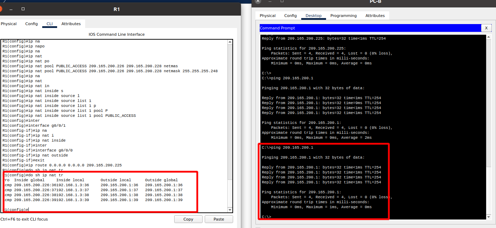
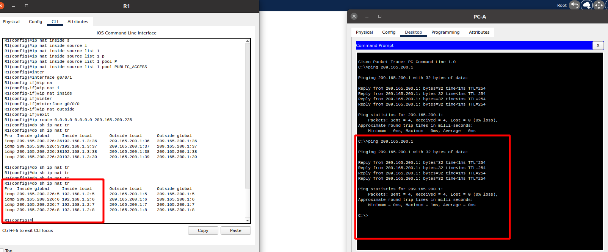
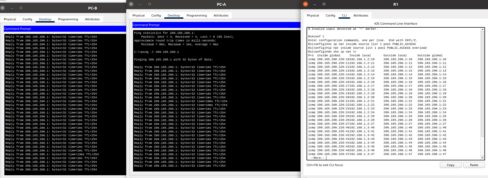
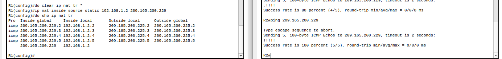

## Настройка NAT для IPv4



- Базовая настройку маршрутизаторов

**R1**

```
enable
configure terminal
hostname R1
no ip domain-lookup
enable secret class
line con 0
password cisco
login
exit
line vty 0 4
password cisco
login
exit
service password-encryption 
banner login |Authorized Users Only|
interface gigabitEthernet 0/0/0
ip address 209.165.200.230 255.255.255.248
no shutdown
exit
ip route 0.0.0.0 0.0.0.0 209.165.200.225
interface gigabitEthernet 0/0/1
ip address 192.168.1.1 255.255.255.0
no shutdown
exit
do copy run st
```

(в задании указано:
 Настройте маршрут по умолчанию. от R2 до  R1.
 кажется опечатка
 )

**R2**

```

enable
configure terminal
hostname R2
no ip domain-lookup
enable secret class
line con 0
password cisco
login
exit
line vty 0 4
password cisco
login
exit
service password-encryption 
banner login |Authorized Users Only|
interface gigabitEthernet 0/0/0
ip address 209.165.200.225 255.255.255.248
exit
interface lo1
ip address 209.165.200.1 255.255.255.224
exit
ip route 0.0.0.0 0.0.0.0 209.165.200.230 
do copy run st
```

- базовые параметры каждого коммутатора

**S1**

```

enable
configure terminal
hostname S1
no ip domain-lookup
enable secret class
line con 0
password cisco
login
exit
line vty 0 4
password cisco
login
exit
service password-encryption 
banner motd |Authorized Users Only|
interface vlan 1
ip address 192.168.1.11 255.255.255.0
exit
interface range fa0/2-4, fa0/7-24,g0/1-2
shutdown
exit
do copy run st
```

**S2**

```
enable
configure terminal
hostname S2
no ip domain-lookup
enable secret class
line con 0
password cisco
login
exit
line vty 0 4
password cisco
login
exit
service password-encryption 
banner motd |Authorized Users Only|
interface vlan 1
ip address 192.168.1.12 255.255.255.0
exit
interface range fa0/2-17, fa0/19-24,g0/1-2
shutdown
exit
do copy run st
```

- Настройте NAT на R1, используя пул из трех адресов 209.165.200.226-209.165.200.228

**R1**

```
access-list 1 permit 192.168.1.0 0.0.0.255
ip nat pool PUBLIC_ACCESS 209.165.200.226 209.165.200.228 netmask 255.255.255.248
ip nat inside source list 1 pool PUBLIC_ACCESS 
interface g0/0/1
ip nat inside
interface g0/0/0
ip nat outside

```






- Настройка и проверка PAT для IPv4

**R1**

```
en
conf t
no ip nat inside source list 1 pool PUBLIC_ACCESS
```



**R1**

```
en
clear ip nat translations *
clear ip nat statistics 
conf t
no ip nat inside source list 1 pool PUBLIC_ACCESS overload 
no ip nat pool PUBLIC_ACCESS
ip nat inside source list 1 interface g0/0/0 overload
```

- Настройка и проверка статического NAT для IPv4.

**R1**

```
en 
conf t
ip nat inside source static 192.168.1.2 209.165.200.229 
```

