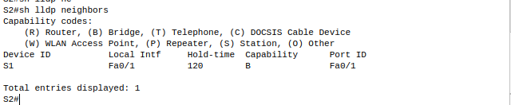

## Настройка протоколов CDP, LLDP и NTP


- Базовая настройка маршрутизатора

**R1**

```
enable
configure terminal
hostname R1
no ip domain-lookup
enable secret class
line con 0
password cisco
login
exit
line vty 0 4
password cisco
login
exit
service password-encryption 
banner login |Authorized Users Only|
int g0/0/1
ip address 10.22.0.1 255.255.255.0
no shutdown
exit
int loopback 1
ip address 172.16.1.1 255.255.255.0
exit
do copy run st
```
- Базовая настройка коммутаторов

**S1**

```
enable
configure terminal
hostname S1
no ip domain-lookup
enable secret class
line con 0
password cisco
login
exit
line vty 0 4
password cisco
login
exit
service password-encryption 
banner motd |Authorized Users Only|
interface range fa0/2-4, fa0/6-24,g0/1-2
shutdown
exit
do copy run st
```

**S2**

```
enable
configure terminal
hostname S2
no ip domain-lookup
enable secret class
line con 0
password cisco
login
exit
line vty 0 4
password cisco
login
exit
service password-encryption 
banner motd |Authorized Users Only|
interface range fa0/2-24,g0/1-2
shutdown
exit
do copy run st
```

- Обнаружение сетевых ресурсов с помощью протокола CDP


тут должен быть вывод команды show cdp traffic, но в CPT  данной команды нет

- Настройте SVI для VLAN 1 на S1 и S2

**S1**

```
enable
configure terminal
interface vlan 1
ip address 10.22.0.2 255.255.255.0
no shutdown
exit
ip default-gateway 10.22.0.1
```

**S2**

```
enable
configure terminal
interface vlan 1
ip address 10.22.0.3 255.255.255.0
no shutdown
exit
ip default-gateway 10.22.0.1
```


- Отключить CDP


**R1, S1, S2**

```
en 
conf t
no cdp run
```

- Включить LLDP


**R1, S1, S2**

```
en 
conf t
lldp run
```
В CPT есть только sh lldp, lldp neighbors команды





- Настройка NTP

**R1**


```
en 
conf t
ntp master 4
```

**S1, S2**


```
en
conf t
ntp server 10.22.0.1
```

