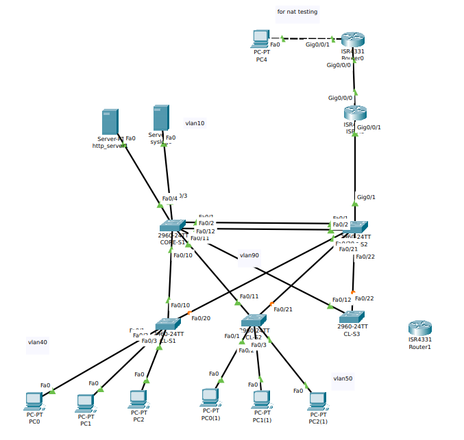

## Построение отказоустойчивой сети с ограниченным бюджетом

### Таблица подключений

name| source port | dest | vlan
---|---|---|---
CORE-S1 | fa0/1 | CORE-S2, fa0/1 | trunk
CORE-S1  | fa0/2| CORE-S2 fa0/2   | trunk
CORE-S1 | fa0/10 | CL-S1 fa0/10  | trunk
CORE-S1 | fa0/11 | CL-S2 fa0/11  | trunk
CORE-S1 | fa0/12 | CL-S3 fa0/12  | trunk
CORE-S1 | fa0/3  | end-user      | 10
CORE-S1 | fa0/4  | end-user      | 10

name| source port | dest | vlan
---|---|---|---
CORE-S2 | fa0/20 | CL-S1 fa0/20  | trunk
CORE-S2 | fa0/21 | CL-S2 fa0/21  | trunk
CORE-S2 | fa0/22 | CL-S3 fa0/22  | trunk
CORE-S2 | g0/1   | ISP-R1 g0/0/1 | trunk

name| source port | dest | vlan
---|---|---|---
CL-S1   | fa0/1  | end-user  | 40 
CL-S1 | fa0/2  | end-user  | 40
CL-S1  | fa0/3  | end-user  | 40
CL-S2   | fa0/1  | end-user  | 50
CL-S2   | fa0/2  | end-user  | 50
CL-S2   | fa0/3  | end-user  | 50

### Список vlan

vlan | network | description
---|---|---
90  | 192.168.90.0/24| MGMT
40 | 192.168.40.0/24 | IT_DEP
10 | 192.168.10.0/24 | SERVER
50 | 192.168.50.0/24 | EMPLOYEE
800 |                | PARKING_LOT
200 |                | TRUNK

### Список адресов

hw | vlan | ip address
---|---|---
ISP-R1 | 90 | 192.168.90.254
CORE-S1 | 90 | 192.168.90.1
CORE-S2 | 90 | 192.168.90.2
CL-S1   | 90 | 192.168.90.21
CL-S2   | 90 | 192.168.90.22
CL-S3   | 90 | 192.168.90.23
ISP-R1 | 40 | 192.168.40.1
all       | 40 | dhcp
ISP-R1 | 50 | 192.168.50.1
all     | 50 | dhcp
http_server1 | 10 | 192.168.10.10
syslog1 | 10 | 192.168.10.11
ISP-R1 |10 |192.168.10.1

### nat pool 

begin|  end
---|---
209.165.200.224 |  209.165.200.230

- [Basic configuration](./Basic_config.MD)

- [VLAN](./Vlan.MD)

- [Routing](./Router_on_Stick.MD)

- [DHCP](./Dhcp.MD)

- [SSH](./SSH.MD)

- [ACL](./ACL.MD)

- [NTP](./NTP.MD)

- [NAT](./NAT.MD)
